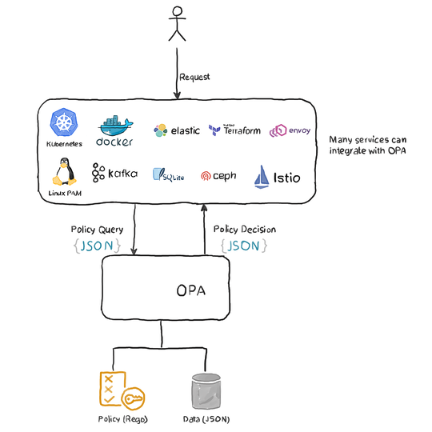

# OPA-Demo
This is a demo for Open Policy Agent using Golang

OPA exposes API's that are not tied to a vendor or domain, which get called and help manage policies.

- Evaluation
    OPA’s interface for asking for policy decisions. Integrating OPA is primarily focused on integrating an application, service, or tool with OPA’s policy evaluation interface. This integration results in policy decisions being decoupled from that application, service, or tool.

- Management
    OPA’s interface for deploying policies, understanding status, uploading logs, and so on. This integration is typically the same across all OPA instances, regardless what software the evaluation interface is integrated with. Distributing policy, retrieving status, and storing logs in the same way across all OPAs provides a unified management plane for policy across many different software systems.

## But why?
What if you accidentally (or intentionally) made an API call to the database service to change the delivery address of the customer to somewhere else? Even worse, what if you had read permissions to the customers’ credit card numbers? 

If you're using K8s and if all users were authorized access to the entire cluster, lots of nasty things can happen such as:

- Giving unlimited requests and limits to all the pods may cause random pods to get evicted from the nodes.
- Pulling and using untested, haphazard images that may contain security vulnerabilities or malicious content.
- Using Ingress controllers without TLS, allowing unencrypted, unsecured traffic to the application.
- Numerous other unforeseen risks due to the overall complexity.

Nah, that's not worth the risk.

That's why, OPA.

With OPA, we can place an authorization control on top of each of our microservices. The control checks whether or not the authentpicated user has the required rivileges to perform the requested operation. 


## Housekeeping
The `rego` package exposes different options for customizing how policies are evaluated. Through the `rego` package you can supply policies and data, enable metrics and tracing, toggle optimizations, etc.

> Rego is a high-level declarative language that was built specifically for OPA. It makes it very easy to define policies and address questions like: is Bob allowed to perform a GET request on /api/v1/products? Which records is he actually allowed to view? and you can play around with it at [RegoPlayground](https://play.openpolicyagent.org/)

> Preparing queries in advance avoids parsing and compiling the policies on each query and improves performance

## The Scenario
Let's say we have a band: [`Iron Maiden`](https://en.wikipedia.org/wiki/Iron_Maiden) who are working on a new record called ... [`Powerslave`](https://www.youtube.com/watch?v=D8XzVUle9AE).

Since the record is a secret project, only a few people can have access to it : 
- The Band 
```
Bruce Dickinson – vocals
Dave Murray – guitars
Adrian Smith – guitars
Steve Harris – bass
Nicko McBrain – drums
```
- Management 
```
Martin "Pool Bully" Birch – producer, engineer, mixing
Frank Gibson – assistant engineer
Bruce Buchhalter – assistant engineer
George Marino – mastering
Rod Smallwood – management, sleeve design, sleeve concept
Andy Taylor – management
```

- Additional Personnel
```
Ross Halfin – photography (1998 edition)
Derek Riggs – sleeve design, sleeve concept, sleeve illustration
Moshe Brakha – photography
```

Not all of them need equal access. If the record were a `REST API`, The `Band` and `Management` would need access to all the songs on `[GET/POST] to /iron-maiden/powerslave/tracks`

Whereas, `Additional Personnel` would only need access to `[GET/POST] /iron-maiden/powerslave/assets`

and let's say I am just a member of the fanclub, so they've given me access to some promotional content exclusive for fan club members on `GET /iron-maiden/powerslave/fanclub`

and lets say `GET /iron-maiden/powerslave/public` has updates and stuff for everyone!

Now that we have our access topology figured out, let us implement this!


## OPA Local Server
- Test a greeting messsage from the server
```
docker run -p 8181:8181 \                                                     
           -v $(pwd):/example \
           --name opa  \
           openpolicyagent/opa \
           eval -d /example data.example.greeting
```
- Test /policies/powerslave 
```
docker run -p 8181:8181 \                                                     
           -v $(pwd):/policies \
           --name opa  \
           openpolicyagent/opa \
           eval -d /policies data.policies
```
- Run the server
```
docker run -p 8181:8181 -v $(pwd):/policies --name opa openpolicyagent/opa \
    run --server --log-level debug
```
> Test it `curl -i localhost:8181/`
```
HTTP/1.1 200 OK
Date: Sun, 11 Oct 2020 18:00:10 GMT
Content-Length: 866
Content-Type: text/html; charset=utf-8

 ________      ________    ________
|\   __  \    |\   __  \  |\   __  \
\ \  \|\  \   \ \  \|\  \ \ \  \|\  \
 \ \  \\\  \   \ \   ____\ \ \   __  \
  \ \  \\\  \   \ \  \___|  \ \  \ \  \
   \ \_______\   \ \__\      \ \__\ \__\
    \|_______|    \|__|       \|__|\|__|

Open Policy Agent - An open source project to policy-enable your service.<br>

Version: 0.23.2
Build Commit: 661ec2f
Build Timestamp: 2020-08-24T18:49:17Z
Build Hostname: f4750a273a5a
```

- Upload the ACL
```
 curl -X PUT http://localhost:8181/v1/data/powerslave/acl -H "Content-Type: application/json" --data-binary @"$(pwd)/policies/data/band.json"
```
> verify `curl GET http://localhost:8181/v1/data/powerslave/acl`

- Upload the Policy
```
curl -X PUT http://localhost:8181/v1/policies/powerslave --data-binary  @"$(pwd)/policies/powerslave.rego"
```
> verify `curl GET http://localhost:8181/v1/policies/powerslave`

- POST the contents of `test.json` as our input to validate
```
curl -X POST http://localhost:8181/v1/data/powerslave/policy/allow \
--data-binary @"$(pwd)/test.json" \
| jq .
```

```
# test.json
{
    "method": "POST",
    "path": "/iron-maiden/powerslave/tracks",
    "user": "Bruce Dickinson"
}
```


## [Conftest](https://www.conftest.dev/install/)
```
$ docker run --rm -v $(pwd):/project openpolicyagent/conftest test <config-file>
FAIL - <config-file> - Containers must not run as root

1 test, 0 passed, 0 warnings, 1 failure, 0 exceptions
```


